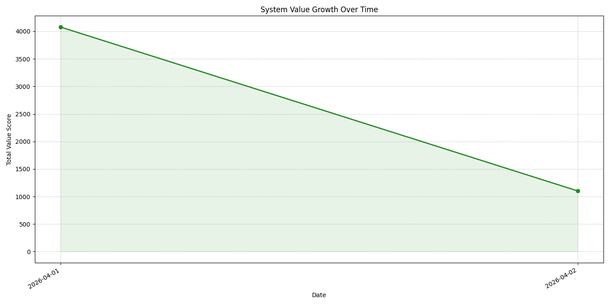
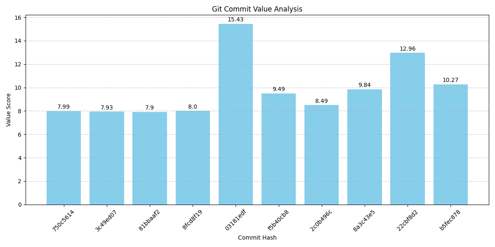

# Comprehensive System Value Report
Generated on: 2026-04-02 08:15:32
Total Commits Analyzed: 225

## 1. Value Growth Over Time

## 2. Value by Milestone / Feature

| Milestone | Total Value | Commits | Avg Value |
| :--- | :--- | :--- | :--- |
| **FEAT:ROLF** | 3447.1 | 30 | 114.9 |
| **GENERAL** | 478.15 | 51 | 9.38 |
| **PHASE 10** | 179.35 | 18 | 9.96 |
| **FEAT:UI** | 156.41 | 19 | 8.23 |
| **PHASE 11** | 97.69 | 10 | 9.77 |
| **FEAT:ACE** | 91.88 | 9 | 10.21 |
| **FEAT:API** | 63.69 | 6 | 10.62 |
| **FEAT:MEMORY** | 46.34 | 5 | 9.27 |
| **FEAT:STITCH** | 43.14 | 4 | 10.79 |
| **10.23** | 40.49 | 1 | 40.49 |
| **FEAT:DB** | 39.05 | 5 | 7.81 |
| **1.0** | 21.52 | 2 | 10.76 |
| **11.9** | 18.78 | 1 | 18.78 |
| **9.8** | 17.34 | 2 | 8.67 |
| **TASK 10.46** | 16.96 | 1 | 16.96 |
| **7.2** | 16.57 | 1 | 16.57 |
| **10.1** | 15.9 | 1 | 15.9 |
| **10.37** | 15.63 | 1 | 15.63 |
| **FEAT:CONSENSUS** | 15.48 | 1 | 15.48 |
| **9.2** | 15.46 | 2 | 7.73 |
| **11.2** | 15.43 | 1 | 15.43 |
| **TASK 10.27** | 13.63 | 1 | 13.63 |
| **11.4** | 12.96 | 1 | 12.96 |
| **11.7** | 12.75 | 1 | 12.75 |
| **TASK 10.49** | 12.39 | 1 | 12.39 |
| **10.70** | 11.39 | 1 | 11.39 |
| **TASK 10.69** | 11.26 | 1 | 11.26 |
| **2.5** | 11.16 | 1 | 11.16 |
| **11.14** | 11.14 | 1 | 11.14 |
| **TASK 7.1** | 10.8 | 1 | 10.8 |
| **10.76** | 10.39 | 1 | 10.39 |
| **11.5** | 10.27 | 1 | 10.27 |
| **10.58** | 10.24 | 1 | 10.24 |
| **10.77** | 9.96 | 1 | 9.96 |
| **10.64** | 9.91 | 1 | 9.91 |
| **10.59** | 9.91 | 1 | 9.91 |
| **10.53** | 9.86 | 1 | 9.86 |
| **11.3** | 9.84 | 1 | 9.84 |
| **9.7** | 9.44 | 1 | 9.44 |
| **TASK 11.12** | 9.42 | 1 | 9.42 |
| **7.4** | 9.24 | 1 | 9.24 |
| **11.21** | 9.0 | 1 | 9.0 |
| **10.34** | 8.76 | 1 | 8.76 |
| **TASK 10.73** | 8.75 | 1 | 8.75 |
| **10.51** | 8.75 | 1 | 8.75 |
| **7.6** | 8.57 | 1 | 8.57 |
| **11.1** | 8.49 | 1 | 8.49 |
| **10.68** | 8.49 | 1 | 8.49 |
| **TASK 10.75** | 8.4 | 1 | 8.4 |
| **10.29** | 8.4 | 1 | 8.4 |
| **10.74** | 8.35 | 1 | 8.35 |
| **TASK 10.66** | 8.33 | 1 | 8.33 |
| **PHASE 6** | 8.32 | 1 | 8.32 |
| **10.35** | 8.27 | 1 | 8.27 |
| **TASK 10.40** | 8.25 | 1 | 8.25 |
| **10.63** | 8.23 | 1 | 8.23 |
| **10.44** | 8.2 | 1 | 8.2 |
| **TASK 10.67** | 8.06 | 1 | 8.06 |
| **TASK 10.87** | 8.0 | 1 | 8.0 |
| **TASK 10.82** | 7.99 | 1 | 7.99 |
| **TASK 10.85** | 7.9 | 1 | 7.9 |
| **10.71** | 7.74 | 1 | 7.74 |
| **11.19** | 7.65 | 1 | 7.65 |
| **11.23** | 7.58 | 1 | 7.58 |
| **11.25** | 7.55 | 1 | 7.55 |
| **10.60** | 7.49 | 1 | 7.49 |
| **10.31** | 7.4 | 1 | 7.4 |
| **10.65** | 6.94 | 1 | 6.94 |
| **10.42** | 6.7 | 1 | 6.7 |
| **11.10** | 6.64 | 1 | 6.64 |
| **10.80** | 6.41 | 1 | 6.41 |
| **11.17** | 6.03 | 1 | 6.03 |
| **9.9** | 6.0 | 1 | 6.0 |
| **10.56** | 2.5 | 1 | 2.5 |
| **TASK 9.6** | 1.0 | 1 | 1.0 |

## 3. Recent Commit Value

| Hash | Score | Subject |
| :--- | :--- | :--- |
| `1cfd3aad` | **7.55** | chore: Add 11.25 future roadmap task placeholder |
| `e0e6cc66` | **10.57** | roadmap: Define next advanced features for Phase 11 |
| `68971a07` | **7.58** | Add 11.23 Future Roadmap task placeholder |
| `c81fd4bd` | **7.58** | Define next advanced features for Phase 11 |
| `18d25294` | **9.0** | Add 11.21 future roadmap task placeholder |
| `859c855a` | **7.65** | Add 11.19 future roadmap task placeholder |
| `ef50b84e` | **8.08** | Roadmap: Define next advanced features for Phase 11 |
| `49d9567e` | **8.18** | fix: remove unused imports in tests/test_ace_service_tdd.py |
| `10c84379` | **6.03** | Roadmap 11.17: Placeholder for next task |
| `00c15900` | **9.37** | Define next advanced features for Phase 11 roadmap |
| `4c4da0d9` | **11.14** | Add placeholder for 11.14 future roadmap task. |
| `e84ad3a7` | **7.99** | Roadmap 11.13: Define advanced features for Phase 11 |
| `43a50a0e` | **9.42** | Add placeholder for future roadmap task 11.12 |
| `5e62ed66` | **6.23** | Implement missing core areas from PRD-01 (Phase 11.12) |
| `6093a12c` | **7.67** | Define next advanced features for Phase 11 roadmap |
| `710f3d21` | **6.64** | Roadmap: Placeholder for 11.10 task |
| `320ca11a` | **12.36** | Define Phase 11 advanced features roadmap. |
| `bca95c2c` | **18.78** | Add 11.9 future roadmap task placeholder. |
| `51023bf9` | **12.75** | Roadmap: Define next Phase 11 advanced features |
| `ec08f7a4` | **12.75** | chore: 11.7 Roadmap task placeholder |