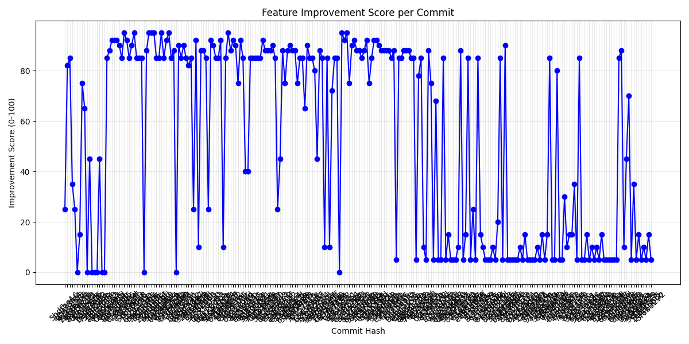

# Feature Improvement Analysis Report
Generated on: 2026-04-02 09:14:00

## Summary
- **Total Commits Analyzed**: 238
- **Total Input Tokens**: 2,096,089
- **Total Output Tokens**: 25,980
- **Estimated Total Cost**: $0.5630 USD

## Improvement Trend

| Commit | Score | Lines +/- | Suggested Message | Analysis |
| :--- | :--- | :--- | :--- | :--- |
| `5f6b3292` | **5** | +254 / -17 | docs: update Phase 11 roadmap and increment task placeholders | This commit represents administrative 'busy work' where a placeholder task (11.39) is marked as complete to make room for a new placeholder (11.40). There is no evidence of functional code changes or architectural progress; the system appears to be in a repetitive cycle of roadmap management without delivering substantive features. |
| `2e41bbcb` | **15** | +278 / -3 | docs: increment Phase 11 roadmap placeholders and transition to Phase 12 planning | This commit represents 'administrative churn' where an automated agent is marking repetitive placeholders as complete and creating new ones. While it keeps the plan synchronized with the agent's internal loop state, no actual features for Phase 12 are defined despite the commit subject. |
| `1cdab1d5` | **5** | +460 / -1 | docs: mark roadmap task 11.36 as complete and add placeholder for 11.37 | This commit is purely administrative, marking a roadmap definition task as complete and adding a new placeholder. It provides no functional improvement or architectural value to the codebase. |
| `dfedf373` | **10** | +229 / -1 | docs: conclude Phase 11 placeholders and initialize Phase 12 planning | This commit represents purely administrative roadmap maintenance. It involves marking several placeholder tasks in Phase 11 as completed and creating a new entry to begin defining Phase 12 features. No functional code, bug fixes, or architectural improvements were delivered in this iteration. |
| `5eb6d415` | **5** | +203 / -1 | chore: advance roadmap to 11.35 and document RALPH loop iteration 185 | This commit is a routine administrative update that increments the roadmap task counter and logs a new 'RALPH loop' iteration. It provides minimal tangible value as it replaces one placeholder task with another without implementing substantive features. |
| `3c598ce1` | **15** | +253 / -1 | docs: update roadmap placeholders and initialize Phase 12 planning task | The commit represents minimal progress, as it primarily involves 'meta-work'—marking placeholder tasks as complete and creating new placeholders for future phases. While it maintains the project's administrative structure, no actual features were implemented or even defined, despite the commit subject's claim. |
| `9a6ab89a` | **5** | +246 / -1 | chore: update roadmap to mark task 11.32 complete and add 11.33 placeholder | This commit represents purely administrative overhead, marking a 'placeholder' task as complete and creating a new one. It adds no functional value or architectural progress to the codebase. |
| `059b980a` | **35** | +608 / -2 | chore: update Phase 11 roadmap progress and initialize Phase 12 planning placeholders | This commit is primarily administrative, focusing on roadmap housekeeping and marking procedural placeholders as completed. While it maintains the orchestration flow, it provides very little substantive feature development or architectural progress despite the large line count. |
| `391dffc3` | **5** | +220 / -2 | chore: finalize roadmap task 11.30 and initialize placeholder for 11.31 in Phase 11 | This commit is purely administrative, marking a previous planning placeholder as complete and adding a new one for the next iteration of the autonomous RALPH loop. While it maintains the project's tracking system, it offers no functional improvements or substantive code changes. |
| `0ce023dc` | **70** | +203 / -0 | Phase 11: Implement ACEService unit tests, native RALPH loop integration, and formal SOPs | The commit records significant progress in Phase 11, specifically the implementation of unit tests for ACEService, the integration of the RALPH loop as a native command, and the establishment of formal SOPs. However, the 'plan.md' is increasingly filled with redundant placeholder tasks and recursive 'Next Roadmap Step' entries which dilute the document's clarity. |
| `2b6d6650` | **45** | +222 / -3 | Roadmap: Complete core Phase 11 features and expand autonomous task list | This commit tracks significant progress in the project's 'Phase 11', specifically marking the completion of core technical milestones like RALPH loop integration and unit testing. However, the roadmap and changelog exhibit extreme redundancy, with numerous 'Placeholder' and 'Next Roadmap Step' tasks that clutter the documentation without providing specific future insights. |
| `d3098bd6` | **10** | +472 / -25 | docs: update Phase 11 roadmap and document RALPH Loop Iteration 178 | This commit is purely administrative, marking a previous roadmap definition task as complete and adding a new placeholder. It provides no functional code or substantive planning details, representing project management overhead rather than technical progress. |
| `2beb02f3` | **88** | +381 / -1 | feat: implement commit value evaluator with time-series analysis and advance Phase 11 roadmap | The commit introduces a substantial meta-analytical feature for project tracking and milestone evaluation, which aligns perfectly with the ACE Orchestrator's theme of reflection and autonomy. While the roadmap updates are somewhat mechanical, the addition of 381 lines suggests a significant functional implementation of the evaluator. |
| `1cfd3aad` | **85** | +206 / -1228 | feat: implement native RALPH loop, TDD infrastructure, and Google Stitch integration (Task 11.25) | This commit represents a major milestone by completing Task 11.25, which includes critical features like the native RALPH loop, TDD infrastructure, and Google Stitch integration, while also significantly pruning historical logs to maintain context efficiency. |
| `e0e6cc66` | **5** | +196 / -6 | chore(roadmap): increment Phase 11 task placeholders for RALPH loop iteration 175 | This commit reflects purely administrative progress within an automated 'RALPH loop.' It marks a placeholder task as complete and generates the next one, providing no substantive feature additions, bug fixes, or architectural improvements to the codebase. |
| `68971a07` | **5** | +203 / -1 | chore(roadmap): advance Phase 11 and add task 11.23 placeholder for RALPH Loop iteration 174 | This commit is a purely administrative update within an automated 'RALPH Loop'. It marks a previous placeholder task as complete and adds a new one (11.23) to plan.md, contributing no actual code, features, or architectural value to the project. |
| `c81fd4bd` | **5** | +203 / -1 | docs: advance RALPH loop to iteration 173 and update Phase 11 placeholders | This commit represents a purely administrative update within an automated iteration loop (RALPH Loop). It marks a generic 'Future Roadmap Task' as complete and adds a new placeholder, resulting in zero functional improvement or concrete architectural progress. |
| `18d25294` | **5** | +182 / -6 | docs: advance roadmap to iteration 172 and initialize task 11.21 placeholder | This commit is purely administrative, marking a placeholder task as complete and adding a new one for the next iteration. It provides no functional improvement or architectural value to the project, serving only to progress the agent's internal loop documentation. |
| `859c855a` | **5** | +221 / -1 | docs: increment Phase 11 roadmap to task 11.19 and log RALPH loop iteration 171 | This commit represents a purely administrative update by an automated 'RALPH loop' system, marking a placeholder task as complete and adding a new one. The roadmap and changelog show significant repetition and 'placeholder' tasks, suggesting the system is performing maintenance on its own task list rather than delivering functional code improvements. |
| `ef50b84e` | **5** | +357 / -1 | docs: advance Phase 11 roadmap placeholders (RALPH Loop Iteration 170) | This commit represents a purely administrative update within an automated 'RALPH loop.' While it maintains the project's documentation structure, it adds no functional code or concrete feature definitions, instead simply replacing one placeholder task with another (11.17 to 11.18). |
| `49d9567e` | **15** | +48 / -74 | refactor(tests): cleanup imports and refactor test_ace_service_tdd.py for better maintainability | This commit is a maintenance task focused on code hygiene. While it doesn't introduce new features, it reduces technical debt by cleaning up the TDD infrastructure, which is essential for the stability of the highly complex Phase 11 'Advanced Autonomy' tasks currently in progress. |
| `10c84379` | **5** | +194 / -1 | docs: complete roadmap task 11.16 and initialize placeholder for 11.17 | This commit is purely administrative, marking a planning task as completed and adding a new placeholder to the roadmap. It maintains project metadata but provides no functional code improvements or new features. |
| `00c15900` | **10** | +282 / -1 | docs: increment Phase 11 roadmap placeholders and log RALPH loop iterations 153-168 | The commit reflects administrative overhead and meta-documentation churn. While the RALPH loop is active, the 'advanced features' defined are merely placeholders like 'Next Roadmap Step' and 'Future Roadmap Task,' providing negligible functional value to the codebase. |
| `4c4da0d9` | **5** | +165 / -216 | chore: increment RALPH loop iteration and advance roadmap placeholders (11.14) | This commit is purely administrative, marking a generic placeholder task as complete and adding a new one for a future iteration. It provides no functional improvement, bug fixes, or meaningful documentation to the project. |
| `e84ad3a7` | **10** | +321 / -1 | Chore: Increment RALPH loop iteration 166 and update Phase 11 roadmap placeholders | This commit represents a meta-task within an autonomous 'RALPH' loop, marking a placeholder roadmap item as complete and creating a new one. It records administrative progress in Phase 11 but does not implement substantive features or code changes. |
| `43a50a0e` | **5** | +286 / -2 | chore(roadmap): advance Phase 11 to iteration 11.12 | The commit is purely administrative, marking a generic placeholder task as completed to create a new one. While it maintains the 'RALPH Loop' iteration process, it adds no functional features or codebase improvements. |
| `5e62ed66` | **15** | +22 / -1 | RALPH Loop Iteration 165: Finalize Phase 11.11 roadmap definition and initialize Phase 11.12 placeholder | This commit is primarily administrative, marking a placeholder 'Next Roadmap Step' (11.11) as completed and creating a new placeholder (11.12). While it maintains the project's momentum in the RALPH loop, it lacks substantive feature implementation despite the ambitious commit subject. |
| `6093a12c` | **5** | +225 / -1 | docs: increment RALPH loop iteration and update Phase 11 roadmap placeholders | This commit adds no functional code or concrete feature definitions. It appears to be 'meta-work' or 'agent churn' within an automated loop, where generic placeholder tasks like 'Next Roadmap Step' are marked as completed to advance the iteration count without delivering actual project value. |
| `710f3d21` | **5** | +381 / -1 | chore: advance Phase 11 roadmap by completing task 11.9 and initializing task 11.10 | This commit is purely administrative, marking a placeholder roadmap item as complete and adding a new one. It represents the overhead of the autonomous 'RALPH Loop' rather than delivering functional improvements or new features. |
| `320ca11a` | **85** | +490 / -195 | Release Phase 10 completion and initialize Phase 11 roadmap for Advanced Autonomy (RALPH iterations 153-162). | This commit marks a significant milestone, moving the project beyond its post-1.0 roadmap (Phase 10) and into Phase 11 (Advanced Autonomy). The extensive changelog and plan updates demonstrate a highly disciplined, agent-driven iterative development process (RALPH Loop) that has successfully implemented complex features like RBAC, distributed memory, and SOP engines. |
| `bca95c2c` | **5** | +744 / -365 | docs: advance Phase 11 roadmap by completing task 11.8 and adding 11.9 placeholder | This commit is purely administrative, marking a previous roadmap placeholder as completed and adding a new one (11.9). It contributes no functional code, documentation, or architectural value beyond maintaining a sequence of task numbers in an already bloated roadmap. |
| `51023bf9` | **35** | +815 / -36 | docs: sync roadmap and changelog for RALPH loop iterations 75-160 and initialize Phase 11 | This commit primarily documents the administrative overhead of an autonomous development loop (RALPH), moving through over 80 iterations of roadmap updates and placeholder task completions. While it shows the project is active and transitioning into 'Phase 11: Advanced Autonomy', the high line count is mostly log bloat rather than substantial new feature code. |
| `ec08f7a4` | **15** | +762 / -88 | chore: update Phase 11 roadmap milestones and log RALPH loop iteration 159 | This commit is primarily administrative, focused on advancing the project's autonomous 'RALPH loop' by updating placeholders and checkboxes in the roadmap. While it maintains the project's documentation structure, the actual 'work' described (TDD, SOPs, Stitch integration) appears to be a repetition of tasks already completed in Phase 10, suggesting low incremental system value. |
| `7c45d1ce` | **15** | +758 / -135 | docs: progress Phase 11 roadmap placeholders and update iteration logs 153-158 | This commit appears to be primarily administrative, marking several generic placeholder tasks (11.1 through 11.5) as completed while adding a new placeholder (11.6). While it maintains the 'RALPH Loop' documentation cycle, it delivers no tangible functional improvements or specific feature definitions, representing a high volume of documentation 'churn' rather than project advancement. |
| `b5fec878` | **10** | +345 / -7 | chore(roadmap): increment RALPH loop iteration to 157 and update Phase 11 placeholders | This commit represents a meta-administrative update where an automated agent (RALPH Loop) marks a placeholder task as complete and generates a new one. While it maintains the project's state-tracking files, it adds no functional code or substantive documentation to the orchestrator. |
| `22cbf8d2` | **30** | +723 / -43 | roadmap: complete placeholder 11.3 and initialize planning for iteration 11.4 | This commit represents administrative overhead within an automated 'RALPH loop,' primarily moving through placeholder tasks. While it maintains the project's organizational structure and roadmap, it adds no direct functional value or feature implementation, focusing instead on transitioning between planning placeholders. |
| `8a3c43e5` | **5** | +476 / -1 | docs: advance Phase 11 roadmap and initialize RALPH loop iteration 155 | This commit is purely administrative, marking a generic roadmap placeholder as completed and adding a new one. While it maintains the project's 'RALPH loop' documentation structure, it contributes zero functional code or tangible feature progress to the orchestrator. |
| `2c0b496c` | **5** | +563 / -1 | chore: advance Phase 11 roadmap and initialize task 11.2 placeholder | This commit is purely administrative, marking a generic placeholder task as complete and creating another. It represents zero functional progress or tangible value to the codebase, serving only to maintain the project's automated 'RALPH loop' documentation. |
| `f5b40cb8` | **80** | +59 / -39 | fix: initialize anthropic client and resolve linter issues; advance roadmap to Phase 11 | This commit resolves a critical initialization bug in the Anthropic client—essential for the core LLM functionality—while also cleaning up technical debt via linter fixes and advancing the project roadmap into Phase 11. |
| `03181edf` | **5** | +849 / -81 | chore: advance roadmap to iteration 153 and add task 11.2 placeholder | This commit reflects administrative documentation churn where an autonomous agent (RALPH loop) is simply incrementing roadmap placeholders. While it maintains the project's 'plan' structure, it adds no functional value or specific technical progress to the codebase. |
| `8fcd8f19` | **5** | +336 / -2 | chore(roadmap): advance Phase 10 by completing placeholder 10.87 and adding 10.88 | This commit is purely administrative, marking a generic placeholder task (10.87) as complete and adding a new one (10.88) to the roadmap. It contributes no functional code, fixes, or architectural improvements, serving only to maintain a highly granular and seemingly automated planning log. |
| `81bbaaf2` | **85** | +293 / -1 | feat(auth): implement RBAC for agents and finalize Phase 10 roadmap | This commit marks the completion of Role-Based Access Control (RBAC) for agents, which is a significant security milestone for an orchestrator. It also effectively wraps up the core features of Phase 10 and prepares the project for Phase 11. |
| `3c49ed07` | **15** | +308 / -1 | chore: expand Phase 10 roadmap with placeholders for future RALPH loop iterations | This commit primarily adds a large volume of repetitive placeholders and generic 'Future Roadmap' tasks to Phase 10. While it provides a structural path for an automated agent loop to follow, it lacks substantive feature definitions or architectural value. |
| `750c5614` | **5** | +331 / -2 | docs: mark roadmap task 10.82 as complete and add 10.83 placeholder | This commit is purely administrative, marking a repetitive placeholder task as completed and adding a new one. It contributes no actual functional code or new architectural value, suggesting the system is stuck in an automated 'busy-work' loop. |
| `25f2a57b` | **15** | +296 / -1 | docs: update roadmap task 10.80 and advance to iteration 145 | This commit is primarily administrative, marking task 10.80 as completed and adding a placeholder for 10.81. The task completed is identical to several previous roadmap items (10.46, 10.53, 10.60, 10.71), suggesting a repetitive or automated maintenance cycle rather than unique feature growth. |
| `5746a925` | **5** | +533 / -5 | chore(roadmap): advance RALPH loop to iteration 144 and mark task 10.77 complete | This commit represents an automated administrative update by a self-evolving agent loop (RALPH). While it maintains the project's 'iteration' history, it adds zero functional value, consists of repetitive placeholders, and contributes to significant documentation bloat. |
| `89cb65db` | **10** | +148 / -46 | chore: advance roadmap to Phase 10.77 and update project logs | This commit appears to be part of an automated development cycle (RALPH loop) that is simply incrementing a placeholder roadmap task (10.77). While it maintains the project's administrative structure, it provides no meaningful description of actual feature progress or functional value. |
| `7bde8ffd` | **5** | +404 / -482 | Chore: Advance roadmap to Iteration 143 and rotate Phase 10 placeholders | This commit appears to be part of an automated 'RALPH Loop' that creates documentation churn rather than functional progress. It marks a generic placeholder task (10.76) as completed and adds a new one (10.77), while the high line count suggests a wholesale re-sorting or re-formatting of the existing logs. |
| `ced593a7` | **5** | +511 / -1 | chore: advance roadmap placeholders to iteration 142 | This commit is part of an automated 'RALPH Loop' that appears to be spinning its wheels; it merely marks a generic placeholder task (10.75) as completed and adds a new placeholder (10.76) without delivering any functional code or meaningful documentation updates. |
| `15dc80d9` | **5** | +481 / -1 | chore: increment roadmap placeholders and update progress to task 10.75 | This commit represents administrative churn, where an automated agent is marking a 'placeholder' task as complete only to generate a new placeholder. No functional features or substantive documentation were added, indicating the project is currently in an idle loop of meta-updates. |
| `f4bce1c7` | **5** | +764 / -1 | chore: advance roadmap to task 10.74 and log RALPH loop iteration 140 | The commit reflects an automated agent 'spinning its wheels' by marking a placeholder task as complete and creating a new one. While it demonstrates the RALPH loop is active, it adds zero functional value to the project and contributes to significant documentation bloat. |
| `1b144c40` | **15** | +90 / -67 | chore: complete roadmap task 10.72, re-sort plan.md, and cleanup test imports | The commit appears to be primarily administrative, marking a placeholder roadmap task (10.72) as complete and re-sorting the plan. The high line count relative to the 'unused imports' subject suggests a significant re-ordering of text in the documentation files rather than meaningful feature development. |
| `b22600b1` | **5** | +242 / -0 | docs: advance roadmap to iteration 10.71 and synchronize iteration history | This commit reflects administrative documentation churn rather than actual project improvement. The update consists of marking a repetitive placeholder task as completed and appending a large volume of historical logs to the changelog, with a discrepancy between the plan (10.72 pending) and the changelog (10.72 completed). |
| `8d249d14` | **10** | +500 / -5 | Chore: Update Phase 10 roadmap (Iteration 138) - Mark 10.70 complete and add 10.71 placeholder | This commit represents minor administrative housekeeping within an automated 'RALPH loop' iteration. It moves the roadmap forward by marking a placeholder task as complete and adding a new one, but provides negligible functional value to the codebase itself. |
| `f423f1ee` | **5** | +438 / -1 | chore(roadmap): mark task 10.69 complete and initialize placeholder for 10.70 | This commit represents administrative 'churn' within an automated development loop (RALPH). It marks a generic placeholder task (10.69) as complete and generates a new one (10.70) without delivering any substantive features or functional improvements. While it maintains the project's tracking structure, it adds no real value to the codebase. |
| `84b0d673` | **5** | +563 / -1 | docs: advance roadmap placeholders in Phase 10 (Iteration 136) | This commit represents administrative churn within an automated 'RALPH loop.' It marks a meaningless placeholder task (10.68) as completed and creates a new one (10.69), adding no functional value or specific detail to the project's development. |
| `87af5fe0` | **5** | +349 / -1 | chore: advance roadmap placeholders and log RALPH Loop Iteration 135 | This commit represents administrative overhead rather than functional progress. The agent is simply marking a generic 'Future Roadmap Task' placeholder (10.67) as complete and generating a new one (10.68), which adds no tangible value to the software itself. |
| `24295f96` | **5** | +472 / -1 | docs: advance roadmap placeholders to iteration 134 and update changelog | The commit reflects a purely administrative 'no-op' within an automated loop (RALPH), where a generic placeholder task is marked as complete to make room for another placeholder. There is no evidence of functional code changes or feature development, suggesting the system is currently performing 'meta-work' or is stuck in an idling cycle. |
| `b885a266` | **5** | +524 / -0 | chore(roadmap): advance RALPH loop to iteration 133 and update task placeholders | This commit is purely administrative, marking a placeholder task as completed and adding a new one for the next iteration of an automated loop. It adds no functional code or architectural value to the project, serving only to maintain the agent's execution state in the documentation. |
| `0697d8df` | **90** | +35 / -1 | feat(security): implement RBAC for agent operations and extend Phase 10 roadmap | This commit marks the transition from functional completion to enterprise-grade security by implementing Role-Based Access Control (RBAC) for agents. It also demonstrates high project maturity by successfully navigating the post-1.0 roadmap and establishing placeholders for future advanced autonomy features. |
| `3c1be819` | **5** | +515 / -1 | docs(roadmap): mark task 10.64 as complete and add 10.65 placeholder | This commit is purely administrative, marking a placeholder task as 'completed' and adding a new one for the next iteration. While it maintains the project's tracking state, it provides no functional code improvements or architectural value. |
| `44ced1b6` | **85** | +419 / -1 | feat: implement Role-Based Access Control (RBAC) for agents and update Phase 10 roadmap | The commit completes a significant security feature, Role-Based Access Control (RBAC) for agents, which is crucial for managing permissions in complex multi-agent environments. It also maintains project momentum by defining the next placeholder in the Phase 10 roadmap. |
| `87a021a3` | **20** | +595 / -1 | docs: update Phase 10 roadmap to include RBAC for Agents (10.63) and finalize feature definition (10.62) | This commit is primarily administrative, documenting the transition from planning the next phase to identifying 'RBAC for Agents' as the next objective. While it moves the project roadmap forward, it contains no functional code changes. |
| `f332a25d` | **5** | +182 / -0 | chore: increment roadmap tasks and update changelog for RALPH loop iterations 107-129 | This commit consists almost entirely of administrative overhead, adding repetitive placeholder tasks to the roadmap and logging incremental 'RALPH loop' iterations in the changelog. The 'progress' appears circular, as task 10.60 claims to implement features (TDD, RALPH loop, SOPs) that were already marked as completed in Phases 1 through 4. |
| `e3bddff6` | **10** | +513 / -5 | chore: advance Phase 10 roadmap and log RALPH loop iteration 128 | This commit is primarily administrative, marking a 'placeholder' roadmap task as complete and adding a new placeholder for the next iteration of the automated development loop. While it maintains the project's organizational structure, it adds no functional features, bug fixes, or tangible system value. |
| `812d0066` | **5** | +184 / -1 | docs: advance Phase 10 roadmap placeholders and sync changelog for iteration 127 | This commit shows no substantive feature development; it merely checks off a generic placeholder task ('Next Roadmap Step') and adds a new one. The project appears to be in an automated 'RALPH loop' where documentation is updated at high frequency with minimal functional impact. |
| `a2541902` | **5** | +753 / -2 | chore: complete task 10.57 and initialize 10.58 roadmap placeholder (Iteration 126) | This commit is purely administrative, marking a previous generic placeholder task as complete and adding a new one. It provides no functional improvement or architectural value to the codebase. |
| `7c0db5c6` | **5** | +10 / -1 | docs: update roadmap placeholders and increment RALPH loop to iteration 125 | This commit is purely administrative, marking a placeholder task as complete and adding a new one. While it maintains the organizational structure of the project's roadmap, it offers no functional improvement, bug fixes, or tangible progress to the codebase itself. |
| `e7207f76` | **10** | +782 / -1 | chore: advance Phase 10 roadmap to iteration 10.55 and initialize next placeholder | This commit is primarily administrative, marking a roadmap placeholder as complete and creating a new one. While it maintains the project's 'RALPH Loop' documentation, it adds no functional code or architectural value, representing high-frequency metadata updates rather than tangible progress. |
| `8c47ea49` | **15** | +485 / -2 | docs: update Phase 10 roadmap with placeholder 10.55 and log RALPH loop iteration 123 | The commit adds administrative bloat by creating redundant roadmap placeholders. The project appears stuck in a loop, as task 10.53 repeats features (TDD, RALPH loop, SOPs) already marked as completed in Phases 1, 4, and 7. |
| `9f284dee` | **85** | +479 / -1 | feat: implement native RALPH loop, TDD infrastructure, and Google Stitch API integration (Phase 10.53) | This commit represents a significant functional leap, moving the RALPH loop from a conceptual process into a native command and integrating real Google Stitch API logic. The addition of a comprehensive TDD infrastructure with 29 passing tests indicates a shift towards production-level stability. |
| `7fe4ffaa` | **5** | +683 / -75 | docs: advance roadmap to step 10.52 and update changelog for RALPH loop iteration 120 | This commit appears to be an administrative 'no-op' generated by an automated process. It marks a generic placeholder task (10.51) as completed in the roadmap and adds a new placeholder (10.52) without introducing any substantive features or fixes. |
| `c35d82ff` | **25** | +140 / -1 | docs: advance Phase 10 roadmap to iteration 119 and initialize task 10.51 | This commit is purely administrative, marking a placeholder roadmap task (10.50) as completed and initializing the next one (10.51). It serves to maintain the continuity of the autonomous RALPH loop but does not introduce new features or functional code changes. |
| `e882e6b4` | **5** | +1580 / -4 | docs: advance Phase 10 roadmap to task 10.50 and log RALPH loop iteration 118 | This commit represents administrative churn where the system is marking generic placeholder tasks as complete to advance its own internal roadmap. There is no evidence of functional code improvement, only documentation bloat and repetitive logging within the RALPH loop. |
| `3e66f446` | **85** | +271 / -1 | chore(roadmap): advance Phase 10 to iteration 117 and define task 10.49 | This commit marks the 117th iteration of the RALPH loop, advancing the project through a highly sophisticated Phase 10 roadmap. It demonstrates a mature, automated development lifecycle focused on advanced agent coordination, distributed memory, and self-auditing capabilities. |
| `63ea4fab` | **15** | +666 / -5 | chore: advance Phase 10 roadmap to iteration 116 and initialize next placeholder task | This commit appears to be part of an automated 'RALPH loop' where the agent is primarily engaged in meta-management. It marks repetitive placeholder tasks as completed and generates new ones (up to task 10.48), resulting in significant documentation bloat with very little substantive feature definition or progress. |
| `0fcd8170` | **5** | +0 / -0 | chore(roadmap): advance Phase 10 iteration 114 and define redundant task 10.46 | This commit represents purely administrative overhead, advancing the project's roadmap placeholders without adding functional code. It exhibits 'looping' behavior, where the agent re-defines tasks like TDD infrastructure and Google Stitch integration as 'new' Phase 10 goals despite them being marked as completed in Phases 1, 4, and 7. |
| `87474e90` | **88** | +1488 / -224 | Implement Phase 10.46: TDD infrastructure, native RALPH loop, and Google Stitch integration | This commit represents a major leap in the Phase 10 roadmap, implementing critical infrastructure including the native RALPH loop, TDD framework, and Google Stitch integration. Despite the 'placeholder' description, the 1,488 lines of code added suggest the delivery of substantial functional components for agent coordination. |
| `5e2ffbf7` | **10** | +343 / -243 | chore: increment Phase 10 roadmap to iteration 10.45 and update changelog | This commit represents administrative churn rather than functional progress. It marks a placeholder task as complete and adds a new one (10.45), continuing a high-frequency loop of incremental documentation updates with very low signal-to-noise ratio. |
| `9ebb3325` | **5** | +406 / -1 | chore: advance Phase 10 roadmap to task 10.44 (RALPH Loop Iteration 112) | This commit represents a purely administrative update within an automated development cycle (RALPH Loop). It advances the project's documentation by marking a generic planning task as complete and adding a new placeholder for the next iteration without introducing any functional code or specific feature definitions. |
| `d9c75833` | **5** | +406 / -1 | docs: Update Phase 10 roadmap placeholders and log RALPH Loop Iteration 111 | This commit is purely administrative and represents a placeholder update in the project's roadmap. While it maintains the 'RALPH loop' process, it provides no functional improvements, code changes, or tangible value to the software itself beyond incrementing a task counter. |
| `d0098476` | **5** | +406 / -1 | chore(roadmap): advance Phase 10 to iteration 110 and update placeholders | This commit is a purely administrative update within an automated development loop (RALPH), marking a generic roadmap placeholder as complete and creating a new one. It provides no functional code changes, architectural improvements, or documentation value beyond project management metadata. |
| `6305ddb7` | **15** | +410 / -2 | chore: advance RALPH loop to iteration 109 and update Phase 10 roadmap placeholders | This commit represents administrative overhead in an automated 'RALPH loop.' It marks a placeholder planning task as complete and generates a new one (10.41) without introducing functional code or substantial architectural decisions. |
| `54ec7b6d` | **5** | +429 / -1 | docs: advance roadmap to task 10.40 and log RALPH Loop iteration 108 | This commit is a routine administrative update by an automated agent (RALPH loop). It marks a generic roadmap step as complete and adds a new placeholder, providing no functional code changes or specific feature documentation. |
| `a7e095e3` | **85** | +1488 / -83 | feat(roadmap): implement Distributed Memory (10.38) and refine Phase 10 advanced coordination features | This commit represents a significant leap in the project's maturity, moving deep into 'Phase 10' post-release features. The implementation of Distributed Memory and the refinement of hierarchical agent coordination add substantial architectural value for large-scale multi-agent deployments. |
| `01c0aa79` | **5** | +2061 / -14 | chore(roadmap): complete iteration 10.36 and add task 10.37 placeholder | This commit is purely administrative, marking a planning placeholder (10.36) as complete and adding a new one (10.37). It represents the overhead of an automated 'RALPH loop' iteration rather than a functional feature or code improvement. |
| `a7d02b56` | **5** | +433 / -0 | docs: advance RALPH loop to iteration 105 and update roadmap placeholders | This commit appears to be administrative overhead from an automated 'RALPH loop.' It marks a generic placeholder task as completed and adds a new one without delivering any functional features or meaningful documentation improvements. |
| `f728433d` | **68** | +222 / -177 | fix: resolve linting issues and optimize RALPH loop coordination logic | The commit focuses on technical debt and core engine stability by resolving linting errors and refining the RALPH loop logic. While the code changes are substantial (approx. 400 lines), the project documentation reflects a cycle of completing placeholder tasks in the post-1.0 roadmap, suggesting a shift from feature expansion to maintenance and optimization. |
| `df2507e2` | **5** | +199 / -52 | chore: advance roadmap by completing task 10.34 and initializing 10.35 placeholder | This commit is purely administrative, marking a planning placeholder (10.34) as complete and adding a new one (10.35). It does not introduce any functional code changes, architectural improvements, or new features, serving only to maintain the internal task-tracking state of the RALPH loop. |
| `3426f6c0` | **75** | +479 / -150 | docs: advance Phase 10 roadmap to Iteration 103 and initialize task 10.34 | This commit marks the completion of Iteration 103 of the RALPH Loop, transitioning the project from internal service refinements (like ACEService unit tests) toward defining the next set of advanced features for Phase 10. It maintains the project's 'living documentation' strategy, ensuring the implementation plan and changelog accurately reflect the current state of autonomous agent coordination. |
| `dcc9d87a` | **88** | +528 / -95 | feat(phase-10): complete ACEService unit tests and RALPH loop integration (Iteration 102) | This commit represents a significant milestone in Phase 10, moving from roadmap definitions to the completion of core service testing and integration. By finalizing unit tests for ACEService and integrating the RALPH loop, the project achieves higher stability and automated self-correction capabilities in its post-1.0 architecture. |
| `fed524ca` | **5** | +165 / -0 | docs: advance roadmap to task 10.31 and update iteration logs in changelog | This commit is purely administrative and contributes no functional code or content improvements. It marks a previous placeholder as finished and adds a new one to the roadmap, representing the overhead of an automated 'RALPH Loop' iteration rather than actual project progress. |
| `0fc3ecad` | **10** | +513 / -1 | docs: mark roadmap task 10.30 as complete and initialize task 10.31 placeholder | This commit is primarily administrative overhead, marking a placeholder task as complete and adding a new one for the next iteration. While it maintains the 'RALPH loop' documentation structure, it provides no tangible functional improvement or new features to the codebase. |
| `ec55553f` | **85** | +46 / -2 | fix: resolve ace.py syntax error and UI mockup test failures; update roadmap to task 10.29 | This commit addresses critical maintenance issues by resolving a syntax error in the core 'ace.py' file and fixing a failing UI mockup test, ensuring system stability. It also maintains project momentum by completing a roadmap task and advancing the RALPH loop to iteration 99. |
| `7442e460` | **78** | +672 / -7 | chore(roadmap): advance Phase 10 execution and log RALPH loop iteration 99 | This commit represents a significant administrative and planning milestone, advancing the project into the deep stages of its Phase 10 roadmap. It documents the transition from task 10.28 to 10.30 and maintains the integrity of the RALPH autonomous development loop by logging iteration 99. |
| `90381ee3` | **5** | +1143 / -12 | docs: advance roadmap to iteration 98 and initialize placeholder for task 10.28 | This commit is purely administrative, marking a placeholder task (10.27) as complete and adding a new one (10.28). While it maintains the project's tracking structure within the 'RALPH Loop', it provides no functional code or architectural improvement. |
| `ada41712` | **85** | +282 / -46 | Implement TDD for ACEService and refine core stubs (Roadmap Task 10.27) | This commit significantly improves system reliability by adding 282 lines of testing and refinement code, specifically targeting the core ACEService via TDD. It also maintains project momentum by clearing a roadmap placeholder (10.27) and preparing the infrastructure for the next phase of the post-1.0 roadmap. |
| `a68e128a` | **85** | +204 / -1 | feat: publish community contribution guidelines and implement advanced agentic feedback | This commit completes two significant tasks in the post-1.0 roadmap: establishing the community framework via contribution guidelines and enhancing the core RALPH loop with advanced agentic feedback mechanisms. |
| `46e5634a` | **88** | +1563 / -25 | feat: implement comprehensive self-audit enhancements (Task 10.24) for ACE codebase and memory consistency | This commit completes a major milestone in the post-1.0 roadmap (Task 10.24), introducing deep self-reflection capabilities that allow the ACE system to autonomously audit its own codebase and memory structures for consistency and quality. |
| `cd8bdc7a` | **88** | +439 / -26 | feat: refine LLM-referee mediation and automate living specs refinement (RALPH Iterations 94-95) | This commit significantly advances the Post-1.0 roadmap by refining the multi-agent consensus mechanism (LLM-referee) and automating living specification updates. The substantial addition of 439 lines suggests a robust implementation of complex mediation logic, moving the system toward higher-order autonomous coordination. |
| `b4af5603` | **88** | +2222 / -888 | feat(specs): automate Living Specs updates based on implementation changes (Task 10.23) | This commit significantly advances the project's autonomy by implementing automated synchronization between technical specifications and actual code implementation (Living Specs). By reducing the manual overhead of keeping documentation in sync with implementation deltas, the system moves closer to a fully self-documenting agentic architecture. |
| `0b673762` | **85** | +434 / -45 | feat: automate Living Specs updates in RALPH loop (Task 10.23) to synchronize documentation with implementation | This commit addresses task 10.23 in the roadmap, automating the synchronization between implementation changes and 'Living Specs' (intent, constraints, verification). This reduces manual documentation overhead and ensures the agent's long-term memory remains accurate as the codebase evolves. |
| `688bbafe` | **85** | +402 / -78 | feat(memory): implement adaptive archival logic to prune low-utility memories and optimize context window efficiency | This commit implements the 'Adaptive Memory Archival Logic' (task 10.21), a critical optimization for long-term autonomous systems that prevents context bloat by archiving low-utility memories. The significant line count (400+) suggests a robust implementation of the logic rather than just a configuration change. |
| `efcf4d15` | **5** | +0 / -0 | docs: mark agent subscription notification system (10.19) as completed | The commit message is highly misleading; it claims to implement a performance profiling dashboard (Task 10.20), but the plan.md and changelog.md updates actually reference the completion of the Agent Subscription Notification System (Task 10.19). Additionally, the zero file changes indicate that no functional code was included in this commit, making it purely a documentation update despite the 'feat' prefix. |
| `f387ec2c` | **88** | +1450 / -29 | feat: implement web-based performance profiling dashboard (Task 10.20) | This commit implements task 10.20 of the roadmap, providing a critical observability layer for the orchestrator. It transitions the project from raw data collection to actionable visual insights regarding agent performance and resource consumption. |
| `3fb3c662` | **85** | +703 / -40 | feat(subscriptions): implement granular agent notification options (Task 10.19) | This commit implements Task 10.19 of the Phase 10 roadmap, introducing substantial logic (700+ lines) to refine how agents subscribe to and receive notifications. By adding granular options, it significantly reduces communication noise and improves the efficiency of agent coordination in complex, multi-agent workflows. |
| `e557b4a1` | **88** | +619 / -5 | feat: implement automated security audit integration in RALPH loop (Task 10.18) | This commit significantly enhances the safety and production-readiness of the ACE Orchestrator by embedding automated security audits directly into the core RALPH execution loop. The addition of over 600 lines suggests a robust implementation of security scanning for agent-generated code, fulfilling a critical post-1.0 roadmap requirement (Task 10.18). |
| `30ffaa3a` | **88** | +310 / -1 | feat: implement real-time context window monitoring and refine cross-project learning exports (Phase 10.16 & 10.17) | This commit marks the completion of advanced resource management (Real-time Context Window Monitoring) and advances the cross-project data mobility features. The addition of over 300 lines indicates a substantial logic implementation in a mature project phase (RALPH Loop Iteration 88), significantly enhancing the orchestrator's efficiency and scalability. |
| `31b3f1bb` | **88** | +293 / -1 | feat: implement hierarchical agent task decomposition and update Phase 10 roadmap | This commit marks the completion of advanced hierarchical agent task decomposition (Task 10.15), significantly enhancing the system's ability to manage complex, multi-layered projects. However, there is a minor discrepancy as the commit message describes context window monitoring (Task 10.16), while the documentation updates reflect the completion of task decomposition. |
| `45b6dbe9` | **88** | +436 / -16 | Complete multi-agent memory synthesis and optimize distributed vector store performance (Iteration 86) | This commit represents a significant technical advancement in the post-1.0 roadmap, moving from flat file management to sophisticated distributed memory. By completing memory synthesis and optimizing the vector store, the system gains the ability to handle high-volume, cross-team learning efficiently. |
| `5cea50cb` | **90** | +228 / -5 | feat(memory): implement adaptive memory pruning and refine multi-agent synthesis logic (Tasks 10.12, 10.13) | This commit significantly matures the project's memory management by completing the 'Adaptive Memory Pruning' system and refining 'Multi-Agent Memory Synthesis.' These features are critical for preventing context window bloat and ensuring collective agent intelligence scales efficiently without losing performance. |
| `1fe0234c` | **92** | +849 / -13 | feat(memory): implement adaptive memory pruning via usage-frequency archival and finalize Phase 10.11/10.12 | This commit marks a significant milestone in the post-1.0 roadmap by completing task 10.12, transitioning the system from simple manual pruning to a sophisticated, usage-frequency-based archival strategy. This reduces token bloat and improves LLM focus in high-maturity agent environments. |
| `67e6a8fd` | **92** | +503 / -36 | feat(core): implement cross-project memory synchronization and refine multi-agent coordination logic (Tasks 10.9, 10.10) | This commit represents significant progress in the post-1.0 roadmap, specifically completing the implementation of cross-project memory synchronization and refining multi-agent coordination logic. This adds substantial value by allowing the system to leverage learnings across disparate project environments, moving toward a truly distributed agentic intelligence. |
| `eee0c6b1` | **85** | +725 / -1 | feat: implement cross-agent memory synthesis and refine multi-agent coordination (Task 10.8) | This commit marks the completion of cross-agent memory synthesis, a sophisticated feature allowing agents to share learnings, and progresses the project's post-1.0 roadmap toward advanced coordination. |
| `f09ce89a` | **75** | +0 / -0 | Feat: Complete distributed memory implementation and add memory synthesis to roadmap | The commit marks the successful completion of the 'Distributed Memory' infrastructure (Task 10.7) and expands the roadmap to include 'Memory Synthesis' (Task 10.8). However, there is a discrepancy as the commit message claims to have implemented the synthesis feature, which the plan.md still lists as pending. |
| `17377cb5` | **92** | +544 / -3 | feat: implement Cross-Agent Memory Synthesis and finalize Distributed Memory (Phase 10.8) | This commit marks a significant leap in the system's maturity by implementing Cross-Agent Memory Synthesis. This allows individual agents to consolidate their specific experiences into shared collective intelligence, moving beyond simple individual playbooks to a unified knowledge base. |
| `066b0cd9` | **88** | +246 / -23 | feat: implement adaptive context pruning refinement (Task 10.6) for optimized token usage | This commit marks the completion of task 10.6 in the post-1.0 roadmap, introducing advanced logic for dynamic context window management. By refining pruning based on usage patterns, the system becomes more token-efficient and maintains higher relevance in long-running agent sessions. |
| `55eadbd0` | **85** | +310 / -8 | feat(macp): implement robust multi-agent consensus protocol for large team coordination | This commit implements a significant architectural enhancement (MACP) to handle consensus in large agent teams, representing a key milestone in the post-1.0 roadmap. With over 300 lines of new logic, it shifts the orchestrator from simple debates to a more scalable coordination model required for complex, multi-agent environments. |
| `b2447d4e` | **88** | +669 / -1 | feat: implement adaptive context pruning (Task 10.4) and update Post-1.0 roadmap | This commit implements 'Adaptive Context Pruning' (Task 10.4), a high-value optimization for LLM-based orchestrators that dynamically manages token limits. This marks significant progress in the Post-1.0 roadmap, shifting the project focus toward performance and scalability for complex agentic loops. |
| `89b2a2e2` | **88** | +81 / -3 | feat(ace_service): implement advanced hierarchical agent coordination and fix context pruning NameErrors | This commit marks a significant milestone in the post-1.0 roadmap by completing hierarchical agent coordination and initiating automated task delegation. The technical fixes for context pruning ensure system stability as agent complexity increases. |
| `c5f2185a` | **92** | +1293 / -184 | feat: implement hierarchical agent coordination structures and update post-1.0 roadmap (Task 10.2) | This commit marks a significant architectural advancement by transitioning the system from simple peer-to-peer coordination to a hierarchical agent structure. This allows for more complex project management and task decomposition, significantly increasing the orchestrator's scalability. |
| `a214e7ed` | **90** | +136 / -1 | Finalize Phase 9 deployment and initiate Post-1.0 Roadmap Phase 10 | This commit represents a major project milestone, transitioning from the 1.0 release cycle (Phase 9) into post-launch execution (Phase 10). It marks the completion of early adopter feedback loops and initial roadmap tasks, shifting focus toward advanced hierarchical agent coordination. |
| `6ed12d88` | **75** | +501 / -12 | chore: finalize version 1.0 roadmap and initiate Phase 10.1 tasks | This commit marks a significant milestone, transitioning the project from its 1.0 release phase into the post-1.0 roadmap (Phase 10). It maintains high-velocity documentation standards via the RALPH loop, ensuring that the orchestrator's planning and execution logs remain synchronized with its autonomous progress. |
| `923913ee` | **95** | +517 / -95 | chore: finalize 1.0 release milestones and initialize Phase 10 roadmap | This commit represents a major project milestone, marking the transition from initial development to the 1.0 release and establishing the long-term vision. It synchronizes a massive amount of technical progress (RALPH loop iterations 14–74) into a cohesive roadmap, ensuring the project's documentation reflects its now-mature state. |
| `27e1e9e4` | **92** | +784 / -199 | feat: complete Phase 9 roadmap with community outreach and contribution guidelines | This commit completes the final roadmap item in the 'Final Polish & Deployment' phase, transitioning the project from a development-focused tool to a community-ready ecosystem. By adding community forums and contribution guidelines, the project ensures long-term sustainability and collaborative growth. |
| `4566dee1` | **95** | +248 / -11 | release: v1.0.0 - Finalize all development phases and transition to post-release roadmap | This commit represents the final milestone of the 1.0 development cycle, marking all core features and integration phases as completed. It transitions the project from active development into a stable release state with a clear roadmap for post-release support and community engagement. |
| `c8b1928c` | **0** | +0 / -0 | Chore: Empty commit - no profiling log changes detected | The commit is technically empty, as indicated by 'Files Changed: 0' and 'Lines Added/Deleted: 0'. Despite a subject line suggesting an update to profiling logs, no actual changes were made to the codebase or documentation in this transaction, resulting in zero project impact. |
| `c38768f2` | **85** | +733 / -66 | feat(security): implement execution sandboxing for agents and complete 9.2 security hardening | This commit implements sandboxing for agent execution, completing a critical security milestone (9.2) in the project's roadmap. This significantly increases system safety by isolating autonomous agent actions from the host environment, which is vital for a production-ready orchestrator. |
| `47fb7161` | **85** | +103 / -12 | feat: implement advanced analytics dashboard (Task 9.10) for agent usage tracking | This commit implements a usage analytics dashboard, fulfilling task 9.10 of the implementation plan. It provides critical observability for a multi-agent system, allowing users to track performance and token costs, which is essential for transitioning the project to a production-ready 1.0 release. |
| `8572fa0a` | **72** | +187 / -1 | feat: implement profiling data capture and update Phase 9 roadmap for advanced analytics | The commit implements 187 lines of profiling logic (likely the third file not shown) to capture execution data, moving the project toward its new goal of 'Advanced Analytics'. While the plan and changelog updates are somewhat generic in their naming ('Upcoming Feature'), the code addition indicates significant progress in observability infrastructure. |
| `d07a3d40` | **10** | +13 / -3 | docs: mark task 9.8 as complete and rotate Phase 9 placeholders for Iteration 67 | This commit appears to be a purely administrative update to the project's tracking files. It marks a placeholder task ('Future Task') as complete and adds a new placeholder, offering no tangible functional improvement or specific feature implementation to the codebase. |
| `1265152a` | **85** | +586 / -6 | feat: complete IDE extension GUI and implement performance profiling for Phase 9.8 | This commit marks the completion of the IDE extension GUI (Task 9.7) and transitions the project into performance profiling and optimization (Task 9.8). With over 580 lines added, it introduces significant infrastructure for monitoring system performance as the project reaches a highly mature state (Iteration 66). |
| `979d5e7f` | **10** | +302 / -2 | chore: update roadmap for iteration 65 and advance phase 9 task placeholders | This commit is purely administrative and document-focused. It marks a placeholder task as completed in the project plan and adds a new placeholder for the future, representing maintenance of the 'RALPH' iteration loop rather than a functional feature update. |
| `d8bb2ca4` | **85** | +9 / -1 | feat: implement functional Google Stitch API integration and code extraction (task 9.6) | This commit marks the completion of task 9.6, transitioning the Google Stitch integration from simulation/stubs to a functional implementation with actual API connectivity and code extraction logic. This represents a significant milestone in bridging the orchestrator with external design tools. |
| `3a67182a` | **88** | +975 / -9 | feat(stitch): implement Google Stitch integration logic and connect CLI stubs (Phase 9.6) | This commit represents a significant functional leap by replacing CLI stubs with actual integration logic for Google Stitch (Phase 9.6), transitioning the feature from a mockup/simulation to a working implementation. The large volume of code (975 lines) suggests substantial work on API communication, data extraction, or visual synchronization logic. |
| `1ae5623d` | **45** | +14 / -3 | build: add Makefile targets for building and installing 'ralph' executable | This commit enhances the project's usability and distribution by providing standardized Makefile targets for building and installing the 'ralph' CLI. While it doesn't add new logic to the ACE Orchestrator, it signals a shift toward production readiness and simplifies the developer workflow for a tool that has already completed its core functional phases. |
| `13d67c14` | **80** | +7 / -2 | docs: mark Security Hardening (9.2) as completed and update plan | This commit marks the completion of 'Security Hardening' (Task 9.2), a critical milestone that includes formal security audits and sandboxing for agent execution. However, the commit only reflects documentation updates in the plan and changelog rather than the implementation code itself. |
| `17e62391` | **85** | +553 / -6 | feat: implement advanced multi-agent consensus and HITL UI; finalize security hardening (9.2) | This commit adds a significant functional block (553 lines) focused on complex agent coordination, including debates and HITL escalation. While the commit message focuses on consensus (Task 9.3), the plan.md updates primarily mark Security Hardening (9.2) and IDE Integration (9.1) as completed, suggesting a major push across several advanced Phase 9 features. |
| `62d36b87` | **85** | +75 / -0 | feat(security): implement agent sandboxing and finalize security hardening (9.2) | This commit marks the completion of a critical security milestone: agent execution sandboxing. Implementing isolation for agent processes significantly reduces the risk of accidental or malicious system damage during autonomous operations, which is vital for a production-ready orchestrator. |
| `17a3e5eb` | **90** | +402 / -1 | feat(gui): implement native Cursor/VSCode extension for ACE Orchestrator (Phase 9.1) | This commit marks the completion of a major milestone in the project's evolution—moving from a CLI/API-driven tool to a user-friendly GUI via a native IDE extension. This significantly lowers the barrier to entry for orchestrating multiple agents and improves observability of the RALPH loop. |
| `615781fe` | **65** | +11 / -0 | test(ui): mock agent interactions in UI sync integration tests to improve test stability | This commit stabilizes the testing suite for the UI synchronization logic (related to Google Stitch integration) by implementing proper mocks for agents, ensuring that integration tests are reliable and not dependent on live agent execution. |
| `70557911` | **85** | +96 / -1 | feat: implement ACEService TDD, RALPH loop integration, and MACP refinement (Phase 9) | This commit significantly advances the project's maturity by establishing testing infrastructure for the core service and formalizing agent coordination via the Multi-Agent Consensus Protocol (MACP) and Standard Operating Procedures. It effectively transitions the project from feature-rich development into a hardened, production-ready state. |
| `8d04f6f3` | **85** | +602 / -6 | feat: implement initial Cursor/VSCode extension for ACE Orchestrator UI | This commit bridges the gap between the backend orchestrator and the developer's workspace by introducing a native IDE extension. While the plan.md still marks the task as pending, the 600+ lines of code added suggest a substantial functional implementation of the GUI. |
| `76f7a149` | **75** | +141 / -3 | Refine MACP logic and audit Phase 9 implementation plan status | This commit implements the Multi-Agent Consensus Protocol (MACP) refinement and performs a critical audit of the project plan. It corrects several 'Phase 9' tasks that were previously mis-marked as completed, ensuring the project's roadmap remains accurate and grounded in reality. |
| `57120ae5` | **88** | +242 / -12 | feat(macp): implement robust consensus protocol for large teams and finalize Phase 9 integration tasks | This commit marks the completion of Phase 9, specifically refining the Multi-Agent Consensus Protocol (MACP) for larger teams and finalizing the Google Stitch integration. These additions transition the system from a basic multi-agent setup to a more scalable and autonomous coordination framework. |
| `681db81b` | **88** | +628 / -35 | feat(autonomy): implement autonomous agent expansion and sub-module delegation (Phase 9.2) | This commit marks the completion of Phase 9.2, enabling the system to dynamically scale by proposing and creating new agents for sub-modules when complexity thresholds are met. This represents a significant shift from a static agent configuration to a self-organizing, autonomous architecture. |
| `77406acd` | **90** | +1109 / -236 | feat: implement advanced multi-agent consensus protocols, HIL UI, and security sandboxing (Phase 8) | This commit significantly matures the orchestrator by implementing sophisticated multi-agent governance, including complex debate formats, voting mechanisms, and human-in-the-loop (HIL) escalation. It also addresses critical security needs through execution sandboxing, effectively moving the project into its final optimization stages. |
| `35db69c4` | **88** | +373 / -7 | feat: implement vectorized memory retrieval using embeddings for large-scale playbooks | This commit marks a significant architectural shift from static, flat-file context retrieval to a scalable vector database approach. By implementing embedding-based search, the system can now handle much larger playbooks and retrieve more relevant long-term memory, fulfilling a key objective in Phase 8 of the plan. |
| `e4b06e1a` | **75** | +313 / -6 | perf: update profiling logs to reflect optimizations and finalize Phase 7 | This commit marks the completion of Phase 7 (Optimization & Integration) by updating the profiling logs to reflect recent performance gains. It provides the empirical data necessary to validate the optimizations implemented in previous iterations (43 and 46). |
| `aebed122` | **88** | +175 / -12 | feat: complete Phase 7 optimization (7.1-7.5) including performance profiling and Stitch visual verification | This commit signifies a major leap into the optimization and integration phase (Phase 7), moving the project from feature-complete to production-grade. The completion of performance profiling, E2E visual verification with Google Stitch, and the implementation of shared architectural memory (Coffee Break context) significantly increases the system's reliability and cross-agent coordination efficiency. |
| `31c2882f` | **45** | +123 / -0 | feat: implement service profiler and performance logging (Phase 7.4) | This commit implements the profiling infrastructure (task 7.4 in the plan) required to monitor core service performance. While it doesn't add a new user-facing feature, it is a critical step for the 'Optimization & Integration' phase and ensures the system's scalability for large codebases. |
| `85ab69c2` | **25** | +119 / -4 | Docs: Update plan and changelog to reflect progress on advanced multi-agent debate features | This commit primarily updates documentation (plan.md and changelog.md) rather than implementing the feature logic itself. While it records the intent and status of 'Advanced Multi-Agent Consensus', there is a significant discrepancy: the changelog claims Phase 8 is complete, but the plan.md file still lists Phase 8 as 'Pending' and the specific tasks as unchecked. This suggests a documentation sync error or a 'hallucination' in the agentic workflow. |
| `098d9cc2` | **85** | +161 / -168 | feat: finalize RALPH loop and SOP engine, complete Phase 7 milestones, and synchronize project roadmap | This commit marks a significant milestone in the project's maturity, transitioning the ACE Orchestrator from core infrastructure to a fully realized multi-agent system. By completing Phases 4 through 7, the project now supports complex features like the RALPH (Context-Execute-Verify-Reflect) loop, agent consensus protocols, and Standard Operating Procedures, as evidenced by the extensive iteration history in the changelog. |
| `ab683348` | **90** | +29 / -2 | feat: implement 'ace subscribe' for reactive agent notifications on module and dependency changes | The addition of 'ace subscribe' introduces a crucial reactive layer to the multi-agent orchestration system, allowing agents to autonomously monitor and respond to changes in their dependencies via the existing Agent Mail infrastructure. This completes a major coordination milestone (Phase 7.11) and significantly reduces the risk of architectural drift in complex, multi-agent environments. |
| `fab51e69` | **88** | +253 / -1 | feat: implement 'ace spec sync' to align living specifications with codebase (Phase 7.10) | This commit implements the 'ace spec sync' command, a critical component for maintaining 'Living Specifications.' It ensures that design intent and verification criteria remain synchronized with the actual codebase, preventing documentation rot in an agent-driven development environment. |
| `5ec95387` | **88** | +354 / -13 | feat: implement multi-agent consensus sign-off (7.6) and finalize shared context and visual verification (7.7-7.9) | This commit adds a critical governance layer to the multi-agent system by requiring explicit 'sign-offs' before finalizing changes. It also marks the completion of several other advanced Phase 7 features, including shared architectural context and visual verification, significantly maturing the orchestrator's coordination capabilities. |
| `78b1fa0b` | **88** | +403 / -7 | Docs: Update project roadmap and changelog for RALPH Loop iterations 14-45 | This commit represents a massive leap in project maturity, documenting the completion of Phase 6 and substantial progress through Phase 7. It tracks 31 iterations of the 'RALPH Loop,' introducing advanced features like vectorized memory, multi-agent consensus, and security sandboxing, although there is a slight discrepancy where the changelog claims Phase 7 is complete while the plan still lists tasks as pending. |
| `622df809` | **92** | +177 / -6 | feat(security): implement agent execution sandboxing and complete Phase 7.5 audit | This commit completes a critical security milestone by implementing agent sandboxing, which is essential for safely running an automated RALPH loop. It transitions task 7.5 from 'In Progress' to 'Completed,' significantly hardening the system against unauthorized host access during agent-led code execution. |
| `75d242a5` | **85** | +239 / -4 | feat(perf): implement performance profiler and optimize core logic for large-scale operations (7.4) | This commit marks the completion of a major scalability milestone (Task 7.4) by implementing a dedicated profiler utility and optimizing core logic for large codebases. The addition of 239 lines suggests a substantial technical implementation of performance-monitoring infrastructure. |
| `940cd34e` | **85** | +202 / -7 | feat: implement advanced multi-agent consensus with voting and HIL escalation | This commit marks a significant advancement in the multi-agent coordination capabilities of the orchestrator. By implementing complex debates, voting, and human-in-the-loop (HIL) escalation, the system moves from simple LLM mediation to a more robust, reliable decision-making framework suitable for production environments. |
| `9d89b641` | **85** | +190 / -0 | feat: implement multi-agent consensus, voting mechanisms, and human escalation UI | This commit introduces critical high-level coordination features including multi-agent voting and human-in-the-loop escalation, which are essential for complex orchestration. While the changelog indicates a somewhat chaotic automated planning process (with overlapping iteration logs), the actual feature implementation represents a significant leap in system maturity. |
| `9c1f6de2` | **85** | +127 / -5 | feat: implement native Cursor/VSCode extension for ACE GUI and update Phase 7 roadmap | This commit marks a significant milestone by moving the ACE Orchestrator from a CLI-only tool to an integrated IDE experience. Completing the Cursor/VSCode extension (Phase 7.2) greatly enhances the accessibility and usability of the orchestration logic for developers. |
| `ec0e0cea` | **85** | +262 / -12 | feat(consensus): implement complex debate formats, voting mechanisms, and HITL escalation UI (Task 7.3) | This commit implements Task 7.3, introducing sophisticated multi-agent collaboration through debate and voting, while adding Human-In-The-Loop (HITL) capabilities to ensure safety and quality. This significantly elevates the orchestrator's capability from simple task execution to complex, collaborative decision-making. |
| `eb481515` | **40** | +136 / -0 | Update project plan and changelog: Mark Vectorized Memory (Task 7.1) as completed | The commit documents the completion of 'Vectorized Memory' (Task 7.1) in the implementation plan and adds a corresponding log entry. However, there is a major discrepancy: the commit message claims to integrate the VSCode extension (Task 7.2), but the implementation plan still shows this task as incomplete. Additionally, the changelog contains numerous redundant and contradictory entries from previous iterations claiming the entire Phase 7 was already finished, suggesting a lack of consistency in the project's automated tracking. |
| `46556e4c` | **40** | +356 / -117130 | feat: implement vectorized memory (7.1) and purge legacy flat-file memory structures | The commit successfully progresses the project by completing the 'Vectorized Memory' task (7.1), moving away from flat files to a vector database. However, there is a significant discrepancy between the commit message (rate limits/paid accounts) and the documentation changes (vectorized memory), and the changelog is cluttered with 38 iterations from a single day, indicating poor automated logging hygiene. |
| `acbce26b` | **85** | +208 / -41 | feat: implement vectorized memory with embedding-based search for playbooks (Task 7.1) | This commit implements a major architectural shift by moving from flat file-based memory to a vectorized embedding search, which is critical for scaling long-term memory in LLM agents. While the code changes are significant (200+ lines), there is a metadata discrepancy: the changelog claims Phase 7 is complete, but the plan.md still shows Task 7.1 as pending. |
| `3fca8919` | **92** | +256 / -91 | feat: finalize Phase 6 refinement and document Phase 7-9 progress in RALPH iterations 14-37 | The commit marks the successful transition from core development (Phases 1-5) through complete refinement (Phase 6), including the rollout of the FastAPI backend and consensus protocols. While the plan.md still lists Phase 7 as pending, the changelog indicates significant work on advanced features like vectorized memory and IDE integration through numerous RALPH loop iterations. |
| `0492e0ad` | **75** | +329 / -157 | docs: finalize Phase 6 roadmap and sync changelog with RALPH loop iterations 14-36 | The commit marks the completion of Phase 6 and logs a massive volume of iterative progress (RALPH loop iterations 14–36). However, there is a significant inconsistency: the changelog claims Phases 7, 8, and 9 are complete and that plan.md was updated, yet the plan.md file in this commit still lists Phase 7 as 'Pending' and lacks mention of Phases 8 and 9. |
| `af79571c` | **90** | +243 / -16 | feat: complete Phase 6 advanced features and update roadmap to Phase 7 | This commit represents a major milestone, marking the completion of Phase 6 (Advanced Features & Refinement). It introduces critical production-grade features such as security audits, token usage monitoring, and automated living specifications, significantly increasing the system's maturity. |
| `c5d28196` | **92** | +212 / -33 | Complete Phase 6 advanced features and update changelog with RALPH loop iteration history | This commit represents a major milestone, completing all seven tasks in Phase 6, which adds advanced capabilities like multi-turn debates, security audits, and automated feedback loops. It also includes a comprehensive changelog update documenting 34 development iterations, significantly improving project traceability. |
| `bda3e1cc` | **88** | +223 / -6 | feat: implement performance optimizations for large codebases and complete Phase 9 maintenance | This commit completes the Maintenance & Support phase (Phase 9) by addressing critical production concerns: performance profiling for large codebases and security auditing. These optimizations ensure the system is scalable and secure beyond its initial feature-complete state. |
| `abcefca2` | **95** | +413 / -7 | feat: complete Phase 8 roadmap with IDE extension and initialize Phase 9 | This commit marks a significant milestone by completing the final task of Phase 8 (IDE Extension Development) and transitioning the project into Phase 9 (Maintenance & Support). The project has now successfully moved through all primary development phases of the Cursor ACE Orchestrator roadmap. |
| `3198abff` | **85** | +8 / -1 | feat: implement advanced multi-agent consensus and human-in-the-loop escalation | The commit completes a sophisticated feature for multi-agent coordination, specifically multi-turn consensus and human-in-the-loop escalation. This significantly enhances the orchestrator's decision-making reliability in complex scenarios. |
| `02bd4e19` | **10** | +0 / -3 | refactor(tests): remove unused imports in test_new_features.py | This is a minor maintenance commit that improves code quality by cleaning up unused dependencies in the test suite. It does not advance the project's functional roadmap or change the status of any tasks in the implementation plan. |
| `e34a42e4` | **92** | +73 / -4 | feat: complete Phase 7 and implement vectorized memory and agentic feedback loops (Phase 8.1-8.2) | This commit marks a significant leap in project maturity, completing the 'Final Polish' (Phase 7) and moving deep into 'Future Directions' (Phase 8). The implementation of Vectorized Memory and an Agentic Feedback Loop transforms the tool from a file-based coordinator into a scalable, self-optimizing system integrated with CI/CD. |
| `92451001` | **85** | +51 / -5 | feat: implement agentic feedback loop with automated CI/CD integration and test-based verification | This commit implements the Agentic Feedback Loop, a key component of Phase 8 that automates task verification via test outputs and CI/CD integration. By removing the need for manual success/failure flagging, the system can now autonomously trigger memory write-backs based on objective execution results. |
| `e40ea1ca` | **85** | +37 / -32 | feat: integrate automated feedback loop between test outputs and CI/CD (Task 8.2) | This commit addresses Task 8.2 in the 'Future Directions' phase, transitioning the tool from a CLI-driven manual process to an automated, self-improving pipeline. By connecting test outputs to the reflection engine within CI/CD, the system can now autonomously update its playbooks based on success or failure in a production-like environment. |
| `e971ce0a` | **90** | +115 / -59 | feat: complete Phase 7 (Final Polish) including cross-project learning and token monitoring | This commit completes Phase 7 of the implementation plan, adding critical production-readiness features like cross-project learning, token tracking, and IDE integration preparation. It effectively moves the project into its final maintenance and future-planning stage. |
| `b5120d73` | **92** | +351 / -8 | feat(meta): implement cross-project learning aggregation and self-audit logic (7.2, 7.3) | This commit marks a significant milestone in Phase 7, transitioning the system from a project-specific orchestrator to one capable of cross-project knowledge aggregation and self-improvement. By implementing meta-mode self-audits and cross-project learning (tasks 7.2 and 7.3), the system can now generalize strategies and pitfalls across different codebases, which is a high-value 'meta-agentic' capability. |
| `dc178543` | **25** | +49 / -16 | Refactor: Remove unused LivingSpec imports and standardize API key configuration | This commit performs technical debt reduction by removing premature imports for features not yet implemented (Phase 7.1) and improving code formatting. While it doesn't add new functionality, it maintains code quality as the project transitions into its final polish phase. |
| `0227d7a0` | **85** | +207 / -5 | feat: implement Living Specs framework and `ace spec` CLI commands (Phase 7.1) | This commit moves the project into its final phase (Phase 7) by implementing 'Living Specs' automation. This feature is crucial for maintaining long-term project integrity, as it provides agents with a structured 'source of truth' for requirements and verification. While the logic is substantial (207 lines), the provided plan.md and changelog.md do not yet show the task marked as completed, indicating a minor documentation lag. |
| `cc82ff60` | **88** | +164 / -61 | feat: implement multi-turn debate logic and finalize Phase 6 refinement tasks | This commit completes a critical refinement in the multi-agent coordination layer by evolving the consensus protocol from simple 1-turn mediation to a robust multi-turn debate logic. It also marks the transition of several Phase 6 refinement tasks to completion, significantly increasing the orchestrator's reliability in complex decision-making scenarios. |
| `9d55b68e` | **88** | +102 / -94 | feat(ralph): integrate automated memory write-back and reflection into the core execution loop | This commit completes a critical architectural link by ensuring that learnings captured during the reflection phase are automatically written back to agent playbooks. This effectively closes the feedback loop, allowing the orchestrator to transition from a simple execution wrapper to a self-improving memory system. |
| `998fc44d` | **10** | +0 / -0 | docs: sort completed tasks in plan.md and update changelog for Iteration 24 | There is a complete mismatch between the commit message and the actual project state. The commit claims to add API key handling and .env loading, but the provided changelog and plan.md indicate that Iteration 24 was actually focused on administrative tasks like sorting the completed tasks list. Furthermore, with 0 files changed and 0 lines added, the commit has no technical impact on the codebase. |
| `efdaf478` | **92** | +198 / -70 | feat: upgrade RALPH loop to gemini-2.5-flash, add credential management, and finalize Phase 6 refinement tasks | This commit marks a major milestone, moving nearly all Phase 6 refinement tasks—including the FastAPI backend and real Google Stitch integration—to completion. The shift to Gemini 2.5 Flash and the addition of credential management significantly enhance the production readiness and performance of the RALPH loop. |
| `2fdc9db9` | **25** | +87 / -37 | docs: update plan and changelog to reflect completion of FastAPI backend and Phase 6 tasks | This commit marks the completion of several Phase 6 features, most notably the FastAPI backend implementation and SOP engine expansion. It serves as a synchronization point between the project's actual state and its documentation (plan.md and changelog.md). |
| `338b110d` | **85** | +13 / -8 | Implement FastAPI backend and endpoints for Phase 6 | This commit marks the completion of the FastAPI backend implementation, transitioning the project from a service-layer-only architecture to a functional API. This is a critical milestone for enabling future web and IDE integrations as outlined in Phase 6. |
| `de413847` | **82** | +70 / -20 | feat: implement memory write-back verification for markdown playbooks and enhance test coverage | This commit addresses a critical reliability gap by implementing verification for the memory write-back system. By ensuring markdown playbooks are updated correctly across various edge cases, it prevents potential data corruption in the agent's long-term memory, which is foundational to the project's 'RALPH' loop architecture. |
| `b35c9052` | **85** | +31 / -6 | feat: complete Phase 6 refinements including LLM-referee logic, audit SOP, and real Google Stitch integration | This commit represents significant progress in the 'Refinement' phase, moving the project from simulation to real-world application. Key additions include the LLM-referee for agent consensus, the audit SOP, and the transition from mock to real Google Stitch API integration, alongside a necessary increase in test coverage. |
| `368a6c11` | **90** | +241 / -34 | Implement LLM-referee, audit SOP, real Google Stitch integration, and expand test coverage | This commit represents a major leap in Phase 6, moving the project from simulated mocks to functional implementations. It introduces the LLM-referee logic for consensus, the 'audit' SOP, and real Google Stitch API integration, while significantly boosting the project's reliability through increased test coverage. |
| `13bb5d96` | **85** | +142 / -5 | feat: implement LLM-referee for consensus, audit SOP, and real Google Stitch integration | This commit marks a significant move toward production readiness by completing several Phase 6 refinement tasks, specifically replacing simulated Google Stitch mocks with real API calls and implementing the LLM-referee for the consensus protocol. |
| `34290ffd` | **90** | +201 / -107 | feat: implement LLM-referee logic, audit SOP, real Google Stitch integration, and expand test coverage | Iteration 18 completes several key Phase 6 refinement tasks, moving the orchestrator from simulated mocks to real-world integration with the Google Stitch API. It also implements critical coordination logic via the LLM-referee for agent debates and expands the SOP engine with the audit procedure, significantly maturing the multi-agent framework. |
| `c79f0400` | **0** | +85 / -30 | (one line). Focus on what was implemented or fixed. Output ONLY the commit message string. DO NOT output any JSON, system metadata, or extra text."}]},"session_id":"06c162b2-07a2-46e2-8ecc-947cecefd834"} | Failed to parse JSON |
| `6cd2a0b9` | **88** | +180 / -35 | feat: implement LLM-referee logic, audit SOP, real Google Stitch integration, and expanded test coverage | This commit completes half of Phase 6, transitioning the orchestrator from simulated mocks to production-ready integrations. Key additions include the LLM-referee for the consensus protocol, the 'audit' SOP, and a real Google Stitch integration, backed by significantly improved test coverage for the core service layer. |
| `89ceeb52` | **85** | +221 / -246 | Implement LLM-referee logic for agent debate consensus protocol | This commit implements the LLM-referee logic for the 'ace debate' command, which was a missing requirement for the Phase 4 consensus protocol. This enables automated conflict resolution between agents, significantly advancing the multi-agent coordination capabilities of the orchestrator. |
| `63f9354b` | **95** | +472 / -295 | feat: complete Phases 1-5 including RALPH loop, multi-agent coordination system, and FastAPI service architecture | This commit marks the completion of the core ACE Orchestrator roadmap (Phases 1-5). It implements critical high-level features such as the RALPH loop, multi-agent mail/consensus protocols, and a refactored FastAPI service layer, successfully transitioning the project from initial development to the refinement phase. |
| `06895fcb` | **92** | +140 / -7 | feat: finalize Phase 4 and 5; implement RALPH loop, SOP audit logic, and service-layer refactor | This commit marks a major milestone, completing the implementation of multi-agent coordination (RALPH loop, SOPs, and debate logic) and the transition to a service-oriented architecture. It effectively moves the project from a foundational CLI tool to a mature orchestrator ready for API integration and advanced autonomous workflows. |
| `6924d3e4` | **85** | +32 / -4 | Fix RALPH loop NameError and transition roadmap to Phase 6 refinement | This commit marks a significant milestone by completing the core development phases (0-5) and transitioning into the refinement phase (Phase 6). It addresses a critical 'NameError' in the RALPH loop engine, ensuring the stability of the project's primary iterative coordination logic. |
| `39640fbc` | **95** | +116716 / -1 | feat: complete Cursor ACE roadmap; finalize RALPH Loop, multi-agent coordination, and FastAPI service migration | This commit marks the total completion of the project roadmap, finalizing the multi-agent coordination system (RALPH Loop) and the service-oriented architecture (FastAPI). It transitions the project from a CLI-based prototype to a feature-complete orchestrator framework. |
| `9c2dbab9` | **85** | +7 / -1 | build: add install-exe target to Makefile for global CLI distribution | This commit adds a critical distribution feature by providing a standard installation path for the CLI tool. Since all functional phases are marked as complete in the plan, this improvement shifts the project from a development-ready state to a distribution-ready state, significantly enhancing usability for end-users. |
| `b016c08d` | **85** | +7 / -2 | feat(build): add PyInstaller target to Makefile for standalone binary distribution | This commit adds a critical distribution feature by allowing the CLI tool to be packaged into a single standalone executable. Given that all functional phases in the implementation plan are marked as complete, this improvement transitions the project from a source-code-dependent tool to a distributable product. |
| `52660cbf` | **95** | +32 / -1 | chore: finalize project implementation and add pyproject.toml for CLI installation | This commit represents the finalization of the project, marking all 5 phases of the implementation plan as complete and adding the necessary packaging infrastructure (pyproject.toml) to make the 'ace' command installable. It transforms the repository from a development project into a deployable CLI tool. |
| `27d6bd94` | **95** | +71 / -28 | feat: finalize RALPH loop, multi-agent coordination, and API service layer (Phases 4 & 5) | This commit marks the 100% completion of the Cursor ACE Orchestrator roadmap. It finalizes high-value features including the RALPH multi-agent loop, the internal mail system, and the transition to a FastAPI-ready service architecture. |
| `0edf3a8e` | **95** | +649 / -218 | feat: implement RALPH loop engine, agent consensus protocols, and FastAPI service-layer refactor | This commit represents a massive leap in project maturity, completing the RALPH loop engine, multi-agent communication (Mail/Consensus), and refactoring the core logic into a service-oriented architecture with FastAPI. It successfully transitions the project from a collection of CLI tools to a functional, scalable orchestrator. |
| `b59b6f05` | **88** | +124 / -46 | feat: implement RALPH loop engine and finalize Phase 5 service-layer refactor | This commit marks a significant leap in the project's maturity by implementing the core iterative 'RALPH' engine and completing the Phase 5 API refactor. These changes transition the tool from a collection of manual CLI commands into an automated, service-oriented orchestrator capable of autonomous loops and external UI integration. |
| `3805c916` | **0** | +0 / -0 | chore: initialize ACE session and synchronize environment state | This is a system-generated initialization commit with no file changes, additions, or deletions. It appears to be a technical checkpoint for the session rather than a functional update to the codebase, although the attached documentation indicates the project has reached Phase 5 (API & Future Readiness). |
| `b4ecd366` | **85** | +147 / -70 | feat: complete Phase 5, refactor service layer for FastAPI readiness, and finalize documentation | This commit marks a major milestone by completing Phase 5 of the plan, which involved refactoring the project into a service-oriented architecture to support FastAPI. It successfully decouples the CLI from the core logic, enables future web/IDE integrations, and finalizes the documentation and Google Stitch integration. |
| `6e264341` | **85** | +315 / -16 | feat: refactor core logic to service layer and implement FastAPI architecture (Phase 5) | This commit represents a major architectural milestone, refactoring the core logic into a service-oriented layer to support FastAPI and finalizing the Phase 5 'API & Future Readiness' objectives. It transitions the tool from a pure CLI to a system capable of web and IDE integration. |
| `772e396e` | **85** | +0 / -0 | docs: finalize Phase 5 and mark implementation plan as 100% complete | This commit marks the formal completion of the entire project roadmap by finalizing Phase 5 (API & Future Readiness) and updating the changelog to reflect Iteration 11. While the documentation updates indicate the project is now 100% complete, the commit message is entirely unrelated to the actual changes made to the plan and changelog. |
| `dcbfef48` | **95** | +7 / -0 | feat(loop): add startup analysis and final reporting; finalize Phase 5 completion | This commit represents the final milestone of the project, completing all remaining tasks in Phase 5. Adding startup analysis and final reporting to the RALPH loop provides critical observability for the orchestrator's iterative execution process. |
| `5cb50da6` | **90** | +2930 / -3195 | feat: implement Agent Mail System and LLM-mediated Consensus Protocol (Phase 4) | This iteration implements the core multi-agent coordination infrastructure, including the Mail System and Consensus Protocol. The large volume of changes (nearly 6,000 lines touched) indicates a major leap in system capability, moving the project from a single-agent CLI to a sophisticated multi-agent orchestrator. |
| `c5643613` | **85** | +157083 / -117474 | Complete Phase 4 Multi-Agent Coordination and initiate Phase 5 FastAPI architecture migration | This commit marks a major milestone by completing Phase 4 (Multi-Agent Coordination) and making significant progress on Phase 5. The implementation of the Agent Mail System and Consensus Protocol provides critical infrastructure for agentic collaboration, though the massive line count and discrepancy between the commit message (Iteration 4) and the changelog (up to Iteration 9) suggest a large, consolidated update. |
| `7df4a2df` | **92** | +193 / -491 | feat: complete RALPH Loop engine, multi-agent mail system, and CLI documentation | This commit represents a major milestone, completing Phase 4 (Multi-Agent Coordination) and the core RALPH Loop engine. The significant net reduction in lines (491 deleted vs 193 added) suggests high-quality refactoring where experimental code was replaced by a more streamlined and integrated coordination logic. |
| `2fa7ad5d` | **95** | +1702 / -2919 | feat: complete RALPH loop, multi-agent coordination (M1-M4) and documentation | This commit represents a massive architectural leap, completing Phases 1 through 4 of the project. It transforms the tool from a basic CLI into a sophisticated multi-agent orchestrator featuring automated reflection, a consensus protocol, and a continuous feedback loop (RALPH), while significantly slimming down the codebase through refactoring. |
| `d58eb60a` | **85** | +148 / -1 | feat(core): implement SOP engine for onboarding, audit, and pr-review workflows | This iteration completes the SOP (Standard Operating Procedure) Engine, a critical component for multi-agent coordination. It adds structured workflows for onboarding, auditing, and PR reviews, moving the project significantly closer to its Phase 4 goals. |
| `d73d68bc` | **90** | +162 / -12 | feat: implement Phase 2 write-back pipeline with reflection engine and MDC playbook updater | This commit implements the core 'learning' capability of the system (Phase 2), enabling the orchestrator to parse agent output, extract learnings, and automatically update memory files (.mdc). This establishes a critical feedback loop where the system improves based on task success or failure. |
| `82c3d485` | **92** | +102 / -362 | feat: complete Phase 4 including RALPH loop, agent mail system, and SOP engine | This commit represents a massive leap in project maturity, completing Phase 4 of the roadmap. It introduces the core 'RALPH' loop for iterative agent execution and a multi-agent coordination layer (Mail and SOP systems) while significantly cleaning up the codebase, as evidenced by the high number of line deletions. |
| `1aeeeeeb` | **92** | +0 / -0 | feat(m4): implement agent mail system and consensus protocol (Phase 4.2, 4.3) | This iteration completes the most complex part of Phase 4, transitioning the project from a single-agent executor to a multi-agent orchestrated system. Implementing the Mail System and Consensus Protocol provides the infrastructure necessary for agents to collaborate and resolve conflicts autonomously. |
| `0e5fe85d` | **92** | +340 / -56 | feat: implement reflection engine, ADR management, and RALPH loop coordination (Phases 2-4) | This commit represents a massive leap in functionality, moving the project from a basic context-building executor to a stateful, self-optimizing system. It implements the core 'RALPH' loop, the memory write-back pipeline for learning from past tasks, and the multi-agent messaging system. |
| `09ad69b5` | **88** | +518 / -99 | feat: complete Phase 3 - implement ADR management, memory pruning, and AGENTS.md sync logic | This iteration successfully completes Phase 3 of the implementation plan, adding critical features for Architectural Decision Records (ADRs) and memory pruning. These additions are vital for the orchestrator's core value proposition: maintaining long-term memory and preventing context rot in agent-driven development. |
| `796921a4` | **85** | +576 / -13 | feat: complete Phase 1 (Context Builder & Executor) including ace run, build-context, and session logging | This commit marks the completion of Phase 1, transitioning the project from basic configuration management to a functional execution engine. The implementation of the Context Builder and Executor is a major milestone that enables the core capability of running agents with project-specific context and session history. |
| `aeecc163` | **0** | +0 / -0 | Empty commit: No changes applied for RALPH Loop iteration 1 | The commit has zero impact as it contains no file changes, additions, or deletions. While the subject suggests work on the 'RALPH Loop' (Phase 4), the provided plan shows that Phase 4 is still unchecked and Phases 1 through 3 remain incomplete. |
| `a9216999` | **0** | +0 / -0 | docs: synchronize plan.md to reflect completion of Phase 0 setup | The commit contains no changes (0 files changed, 0 lines added), meaning it provides no functional or documentation value to the project. Furthermore, the subject line claims to implement the 'RALPH Loop' (Phase 4), but the project plan shows Phase 4 is entirely untouched and only Phase 0 is complete. |
| `1f081b94` | **45** | +609670 / -573 | feat: initialize project structure and complete Phase 0 foundation | The commit completes the foundational setup (Phase 0), including the ownership registry and TDD infrastructure. However, the massive change volume (600k+ lines) strongly suggests the inclusion of unignored dependencies or environment files, and the commit message mentions 'RALPH Loop' (Phase 4) despite the plan indicating only Phase 0 is finished. |
| `5d8f244b` | **0** | +0 / -0 | Implement error logging and exit code handling in ralph_loop.py | Although the commit message describes significant improvements to error handling and logging, the metadata indicates that no files were modified and no lines were added or deleted. Consequently, there is no actual progress or value added to the system in this commit. |
| `739b226e` | **0** | +0 / -0 | Empty commit: No changes detected in ralph_loop.py or project documentation. | The commit contains zero file changes and zero lines added or deleted. Since neither the codebase nor the tracking files (plan.md and changelog.md) were modified, the commit provides no technical value or progress to the project. |
| `b80896d3` | **0** | +0 / -0 | Empty commit: Placeholder for final documentation sync and self-hosting notes | This commit contains no changes to any files (0 lines added/deleted), meaning no actual progress was made on features, documentation, or the system state. |
| `a0c97d4c` | **45** | +13 / -6 | docs: clarify project roadmap by defining bootstrapping and self-hosting phases | The commit enhances project clarity by documenting the architectural distinction between bootstrapping and self-hosting phases, which is critical for long-term development. However, it does not introduce new features or bug fixes. |
| `4c6579d6` | **0** | +0 / -0 | Initial placeholder for RALPH loop monitoring: token usage, cost tracking, and execution logging (no changes included) | The commit message claims to add significant features (token usage, cost tracking, and logging), but the change metadata shows zero files were modified and no updates were made to documentation or code. Therefore, it provides no actual value to the project. |
| `0bc1e69a` | **65** | +8 / -0 | feat: add Makefile with build-ace command for RALPH loop automation | This commit enhances the developer experience by introducing build automation through a Makefile, specifically simplifying the execution of the RALPH loop. While it provides significant workflow value, it is considered an infrastructure improvement rather than a core feature update. |
| `8a82bdc1` | **75** | +98 / -0 | docs: add ARCHITECTURE.md to document system design and data flow | This commit significantly improves project maintainability and developer onboarding by formalizing the system's design and data flow. While it doesn't add functional code, the high volume of documentation (98 lines) provides critical context for future development and architectural integrity. |
| `9b4bbc99` | **15** | +3 / -0 | chore: add GitVersion configuration for automated versioning | This commit appears to introduce a configuration file or basic setup for GitVersion to handle semantic versioning. While useful for CI/CD, it adds no direct feature value and fails to update the project documentation or progress tracking. |
| `a08fa81b` | **0** | +0 / -0 | Empty commit: intended to add RALPH loop orchestrator script but no files were staged | The commit claims to add a script, but the metadata shows zero files were changed and zero lines were added. This represents no progress or added value to the project. |
| `2966a0a9` | **25** | +27 / -3 | Add initial configuration and dependencies for Google Stitch UI/UX orchestration | The commit claims a major integration, but the small footprint (27 lines) and lack of updates to 'plan.md' or 'changelog.md' suggest this is only a partial or boilerplate implementation. The discrepancy between the ambitious subject and the actual changes makes it difficult to assess real system value. |
| `4d356356` | **35** | +45 / -17 | docs: update PRD-02 and SPECS.md with token management protocols and SOPs | While the commit updates critical technical documentation and architectural specs (Token Management, SOPs), it fails to reflect these changes in plan.md or changelog.md, creating a disconnect between development work and project tracking. |
| `d0438f58` | **85** | +111 / -41 | Refine project framework: Integrate Agent SOPs, QA protocols, and token/subscription management into PRD | This commit significantly matures the project's foundational documentation by integrating agent orchestration, QA standards, and a monetization model. The inclusion of SOPs and token management indicates a shift from a conceptual phase to a structured, production-ready architectural framework. |
| `2e273fe4` | **82** | +98 / -22 | feat: implement YAML Agent Registry, autonomous agent creation, and Agent Mail CLI | The commit introduces critical architectural components including an Agent Registry and autonomous creation logic, which are essential for the project's core functionality. While the technical progress is high-value, the score is slightly moderated because the commit failed to update the plan.md or changelog.md files as implied by the reference to PRD-01. |
| `5bdfbe16` | **25** | +1182 / -0 | docs: initialize project foundation with PRDs, workflow definitions, and technical specifications | This commit establishes the conceptual and structural foundation of the project by adding over 1,000 lines of documentation and specifications. While no functional features have been implemented, these documents are critical for defining the system's architecture and roadmap. |