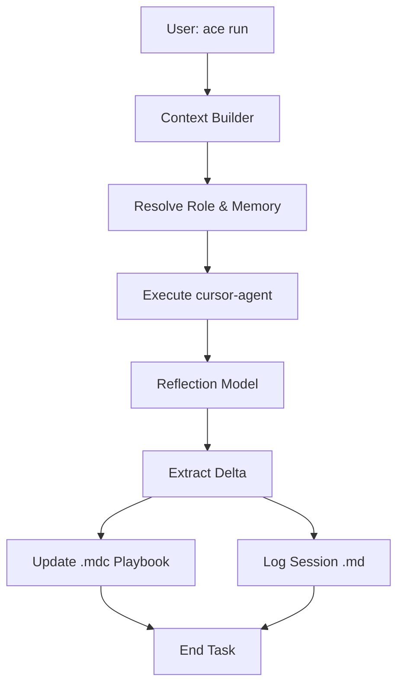

# Cursor ACE Orchestrator Workflow

This document describes the end-to-end workflow for the **Cursor ACE Orchestrator**, from initialization to the automated write-back loop.

## 1. Initialization (`ace init`)
The workflow begins by preparing the repository for agent orchestration.
- Creates the `.ace/` directory for tracked metadata.
- Creates the `.ace-local/` directory for local session state (git-ignored).
- Generates a default `AGENTS.md` in the root if it doesn't exist.
- Sets up the `ownership.yaml` registry.

## 2. Defining Roles & Ownership (`ace own`)
Before running tasks, code modules are mapped to specific agent roles.
- **Assign Ownership**: `ace own src/auth --role auth-agent`
- **Registry Update**: The orchestrator updates `.ace/ownership.yaml`.
- **Playbook Creation**: A corresponding `.cursor/rules/<role>.mdc` is created using a template if it doesn't exist.

## 3. Execution Loop (`ace run` & `ace loop`)
The core loop consists of four distinct phases, with an optional iterative wrapper.

### Phase A: Context Building
When a user runs `ace run "task"` or `ace loop "task"`, the orchestrator:
1. **Resolves Role**: Finds the owner of the target file(s) via longest-prefix match in `ownership.yaml`.
2. **Gathers Memory**: 
   - Reads global rules (`_global.mdc`).
   - Reads the role-specific playbook (`<role>.mdc`).
   - Fetches recent decisions (ADRs) from `.ace/decisions/`.
   - Retrieves state from the last session in `.ace/sessions/`.
3. **Composes Prompt**: Wraps the user task with a "Task Frame" (e.g., `implement`, `debug`, `review`) and the gathered context.

### Phase B: Execution (RALPH Cycle)
- **Execute**: The orchestrator invokes the `cursor-agent` in headless mode.
- **Verify (TDD)**: If running via `ace loop`, the orchestrator executes the specified test command (e.g., `npm test`).
- **Analyze**: If tests fail, a reflection prompt analyzes the failure to update the memory for the next iteration.
- **Coordinate**: If multiple agents are involved, they communicate via **Agent Mail** to reach consensus on cross-module changes.

### Phase C: Reflection (Write-back)
Once the task is completed (or max iterations reached):
1. **Reflection Prompt**: The orchestrator sends the agent's output and test results to a reflection model.
2. **Extraction**: The model identifies:
   - **Strategies** (`[str-XXX]`) that worked or failed (updating `helpful`/`harmful` counters).
   - **Pitfalls** (`[mis-XXX]`) encountered.
   - **Decisions** (`[dec-XXX]`) for ADRs.
3. **Delta Update**: A JSON delta is generated for the playbook.

### Phase D: Persistence & Best Practices
- **Playbook Update**: The `.cursor/rules/<role>.mdc` is updated incrementally.
- **Session Logging**: Detailed logs are stored in `.ace/sessions/`.
- **Principles Enforcement**:
  - **TDD**: No code without a failing test first.
  - **YAGNI**: Implement only what is needed to pass the current test.
  - **DRY**: Shared utilities are extracted if used in >1 place.

## 4. Memory Management (`ace memory`)
Over time, the orchestrator maintains the playbooks:
- **Pruning**: `ace memory prune` removes strategies where `harmful` counts significantly outweigh `helpful` counts.
- **History**: `ace memory history` allows the user to browse past session logs to understand how a playbook evolved.

---

## Summary Diagram

